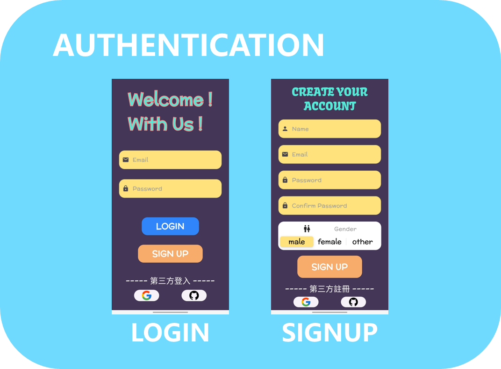
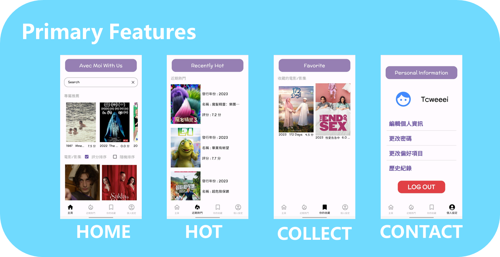
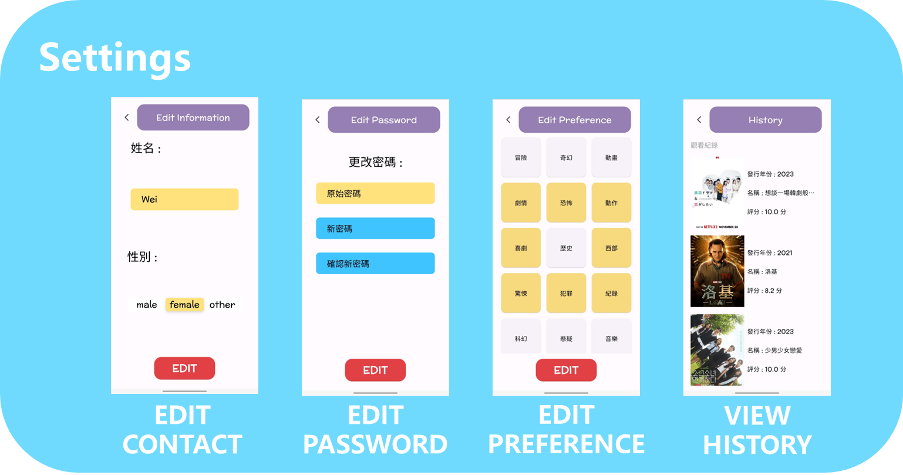
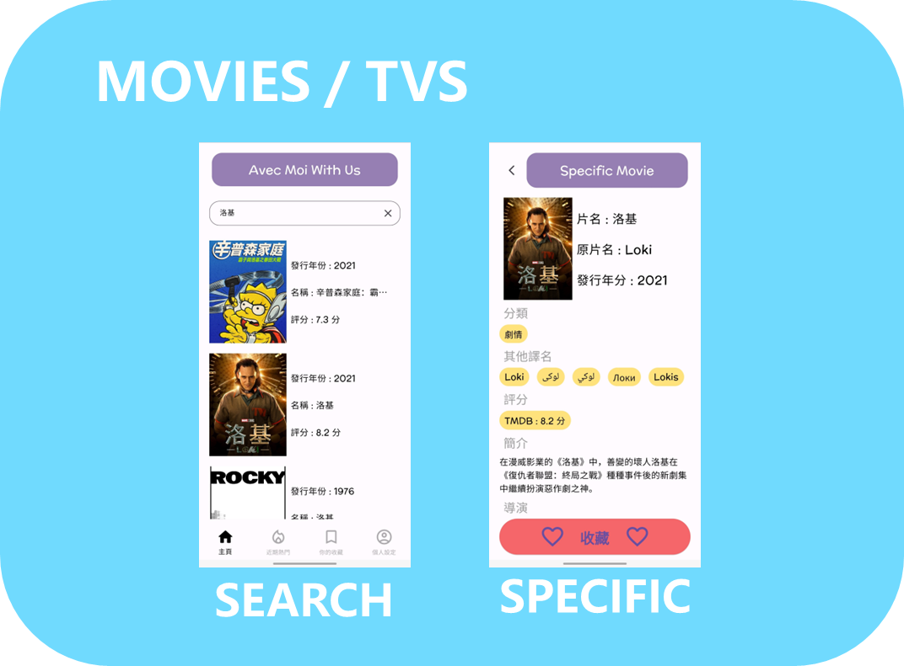

# Avec Moi With Us
An application for recommend movies/tvs.

## Product's Primary Features
* Authentication via Third-Party (Google, GitHub)
* Recommend movies/tvs for user
* Movies/Tvs list by rank
* List random movies/tvs
* Search movies/tvs
* Gain specific movie/tv information
* Collect movies/tvs user like
* Record movies/tvs has watched
* ...

## User Interface
### Authentication (Login, Signup)

### Primary Feature (Home, Recently Hot, Favorite, Information)

### Setting (Edit Contact, Edit Password, Edit Preference, View History)

### Movies / Tvs (Search, Specific)

## Design Pattern
### MVC ( Model - View - Controller )
